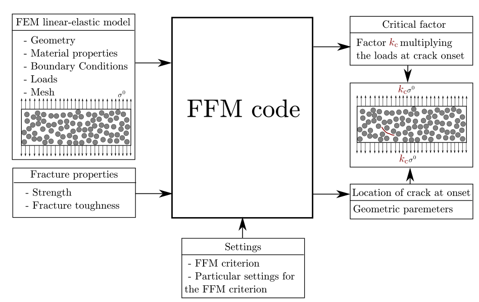

# FFMcracking: Coupled Criterion for Crack Initiation in Abaqus

This repository contains a Python script for Abaqus that applies the **Coupled Criterion** of **Finite Fracture Mechanics** in an automated manner to predict crack initiation. The script integrates with Abaqus to perform simulations and identify crack onset based on the coupled **stress** and **energy** criteria.

## How It Works

The user needs to provide:

- An Abaqus **input file** (`.inp`) created with Abaqus CAE, where the **geometry, material properties, boundary conditions, and mesh** are defined. This input file can be generated following the standard Abaqus CAE workflow.
- A separate **auxiliary file** specifying the **fracture and strength material properties**.
- (Optional) **Hypotheses** about the **crack initiation geometry**, such as **crack direction** and **initiation point**. Providing more hypotheses will speed up the computation. If not specified, the script attempts to estimate the optimal crack geometry at initiation (*feature under development*).

The script calculates the **load factor** that, when applied to the loads in the user-defined model, leads to **crack initiation**, along with the corresponding crack geometry.



## Features

### Current Features
- Given a predefined crack geometry at initiation, computation of the **load factor** required to satisfy both the **stress** and **energy** criteria.
- Given a known **initiation point** and **crack direction**, automatic **Bayesian Optimization** to determine the **optimal crack length** and **critical load factor**.

### Upcoming Features
- **Crack propagation analysis**: Computation of crack growth steps after initiation, following the coupled criterion of finite fracture mechanics.
- **Multi-parameter optimization**: Optimization of crack initiation **direction** and **location**, when unknown.
- **Integration with Abaqus ODB output**: Results will be saved directly in an **ODB** file.
- **Crack initiation along bimaterial interfaces**.
- **Crack initiation in 3D solids**.

## Prerequisites

Before running the script, ensure you have:

- **Abaqus 2020 or later**  
  > *Note:* Abaqus 2014 has a known issue that limits the number of degrees of freedom when using XFEM.

## Usage

The best way to learn how to use FFMcracking is by following the provided examples:

1. **[Example 1](https://github.com/israelgarcia86/FFMcracking/tree/main/samples/sample1_OpenHoleCrackFixed)**  
   - Computes the load factor required for a **fixed crack geometry** at initiation.
   
2. **[Example 2](https://github.com/israelgarcia86/FFMcracking/tree/main/samples/sample2_OpenHoleBasicOptimLenght)**  
   - Uses **Bayesian Optimization** to determine the **critical load factor** for a problem where only the crack length is unknown.

*More examples will be added as new features are developed.*

## How to Cite FFMcracking

If you use `FFMcracking` in your research, please cite the following reference:

```
@article{garcia2025,
  year = {2025},
  volume = {1},
  number = {},
  pages = {},
  author = {Israel G. García and Vladislav Manti\v{c}},
  title = {Implementación en un código comercial del Criterio Acoplado de la Mecánica de la Fractura Finita},
  journal = {Revista del Grupo Español de Fractura}
}
```
# How to contribute

If you are interested in collaborating, we are willing to developing joints collaborations for:

- Developing new features from the list (see Features section or issues).
- Proposal of new features.
- Testing the script with new applications.

If you could be interested to collaborate with us, you have several options:

- Contact the the project administrator:  
[Israel G. García](mailto:israelgarcia@us.es) with your ideas, motivation, etc.
- Open an issue.
- Fork the reposiroty and PR with your contribution.

# Contact

For questions or contributions, please contact the project administrator:  
[Israel G. García](mailto:israelgarcia@us.es)  